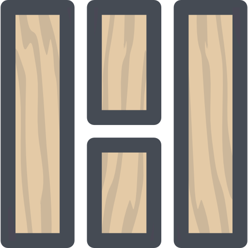

  

<h1 align="center">
  Logboard - Web Application for view logs in several tabs
</h1>

<h2>О приложении</h2>

  Logboard — это серверное приложение на Go, которое предоставляет интерфейс для логирования сборок с поддержкой WebSocket и HTTP. 
  Также приложение автоматически архивирует логи раз в неделю.

<h2>Функции</h2>
<ul>
    <li><b>WebSocket:</b> в реальном времени обновляет логи сборок на клиенте.</li>
    <li><b>HTTP API:</b> поддерживает добавление новых логов через POST-запрос.</li>
    <li><b>Архивация:</b> автоматически архивирует логи каждую неделю.</li>
    <li><b>Простое и минималистичное отображение:</b> все логи организованы по вкладкам.</li>
</ul>
<h2>API Endpoints</h2>
<h3>Добавление лога</h3>

<b>URL:</b> POST /log

<table>
    <thead>
        <tr>
            <th>Параметр</th>
            <th>Тип</th>
            <th>Описание</th>
        </tr>
    </thead>
    <tbody>
        <tr>
            <td><code>tab</code></td>
            <td>string</td>
            <td>Обязательный. Вкладка для отображения лога. Варианты: <code>packages-common</code>, <code>sdk</code>, <code>eap</code>.</td>
        </tr>
        <tr>
            <td><code>status</code></td>
            <td>string</td>
            <td>Обязательный. Статус лога. Варианты: <code>success</code>, <code>error</code>, <code>info</code>.</td>
        </tr>
        <tr>
            <td><code>data</code></td>
            <td>string</td>
            <td>Обязательный. Данные лога в виде строки.</td>
        </tr>
    </tbody>
</table>
<h3>Пример запроса:</h3>
<pre><code>curl -X POST http://localhost:8000/log \
-H "Content-Type: application/json" \
-d '{
  "tab": "packages-common",
  "status": "success",
  "data": "Build completed successfully"
}'</code></pre>
<h3>Пример ответа:</h3>
<pre><code>{
  "message": "Log added successfully"
}</code></pre>
<h2>Установка и запуск</h2>
<ol>
    <li><b>Клонируйте репозиторий:</b>
        <pre><code>git clone https://github.com/username/logboard.git
cd logboard</code></pre>
    </li>
    <li><b>Установите зависимости и запустите сервер:</b>
        <pre><code>go build -o logboard
./logboard</code></pre>
    </li>
    <li><b>Откройте в браузере:</b> <a href="http://localhost:8000">http://localhost:8000</a></li>
</ol>
<h2>Архивация логов</h2>

    Логи автоматически архивируются раз в неделю в формате <code>.zip</code>. Архивы хранятся в директории <code>archives/</code>.

<h2>Лицензия</h2>

    Данный проект лицензирован на условиях лицензии MIT. Подробнее смотрите в файле <code>LICENSE</code>.

    &copy; 2024 Logboard. Все права защищены.

